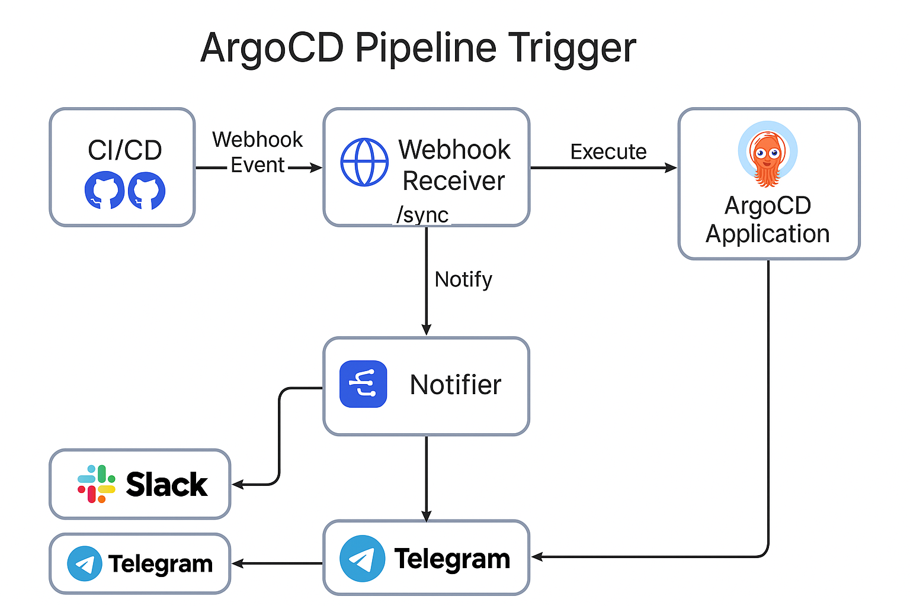

# 👋 Welcome to ArgoCD Pipeline Trigger

> A robust, secure, and GitOps-friendly solution to trigger ArgoCD syncs from CI/CD pipelines — complete with Slack/Telegram notifications, observability, Helm chart deployment, and Go-based tooling.

---

## ✨ What is this?

**ArgoCD Pipeline Trigger** is a modern DevOps tool that enables you to automatically sync ArgoCD apps whenever you merge a PR or trigger a CI/CD pipeline.

It includes:
- ✅ Go CLI to trigger syncs manually or from pipelines
- ✅ Webhook Receiver to automate triggers via HTTP
- ✅ Notifications via Slack and Telegram
- ✅ Exporter endpoint for Prometheus (`/metrics`)
- ✅ Helm Chart for production-ready deployment

---

## 🔍 Who is it for?

- DevOps Engineers looking to automate ArgoCD
- SREs seeking GitOps-safe syncs and notifications
- Platform Engineers building GitHub → Argo pipelines
- Engineering teams that need traceability and visibility in deploys

---

## 🧠 Why was it built?

Most GitOps teams want to keep ArgoCD declarative — but also want control over *when* a sync happens. This project bridges CI with GitOps using a clean Go CLI, observable receiver, and best practices in infrastructure security and deployment.

---

## 📦 Features at a Glance

| Feature                     | Description |
|-----------------------------|-------------|
| ✅ Go CLI                   | `argocd-sync` syncs apps via ArgoCD API |
| 🌐 Webhook Receiver         | HTTP endpoint for pipelines (GitHub, GitLab, etc.) |
| 🔔 Notifications            | Slack + Telegram support with emoji and markdown |
| 📈 Prometheus Metrics       | Built-in metrics endpoint + ServiceMonitor support |
| 🎯 Helm Chart               | Deploy it anywhere with GitOps compatibility |
| 🔐 Secure by Design         | Secrets via env/Helm, timeout, no default creds |
| 🔬 Observability            | Full dashboard support via Grafana |

---

## 🚀 Ready to try it?

Start with the [Quickstart guide](quickstart.md) and deploy your first automated sync with notifications in under 2 minutes.

Looking to contribute? Check the [Contributing guide](contributing.md).